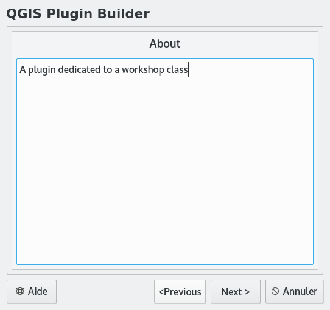

QGIS comme plateforme
=====================

QGIS, présente une interface avec un grand nombre de fonctionnalités qui sont adaptées à des utilisateur SIG avancés. Cependant QGIS est aussi une plateforme qui permet de présenter au un autre type d'utilisateur, une interface adaptée à ses besoins.

Dans ce court tutoriel, deux heures environ, nous faisons un tour d'horizon de quelques une des fonctionnalités de QGIS qui permettent ce type de personnalisation.


Télécharger les données
-----------------------

Un shapefile des chantiers du Grand Lyon est disponible [ici](http://smartdata.grandlyon.com/smartdata/wp-content/plugins/wp-smartdata/proxy.php?format=Shape-zip&name=pvo_patrimoine_voirie.pvochantierperturbant&commune=&href=https%3A%2F%2Fdownload.data.grandlyon.com%2Fwfs%2Fgrandlyon%3FSERVICE%3DWFS%26REQUEST%3DGetFeature%26typename%3Dpvo_patrimoine_voirie.pvochantierperturbant%26outputformat%3DSHAPEZIP%26VERSION%3D2.0.0%26SRSNAME%3DEPSG%3A3946). Vous pouvez obtenir des détails en visitant http://smartdata.grandlyon.com/search/?Q=chantier.

Une fois le fichier récupéré, il faut le décompresser.


Charger les données dans QGIS
----------------------------

### Fond de plan

QGIS est une plateforme interopérable, et à ce sens peut ouvrir des flux provenant d'autres systèmes, en particulier des flux standardisés OGC. On peut ainsi bénéficier de ressources déjà existantes pour créer plus simplement notre application.

Ouvrir le menu 'Layers' et choisir 'Add WMS/WMTS Layer'. Dans la boite de dialogue cliquer sur 'new' et informer les champs suivants:
* Name: Grand Lyon
* URL: https://download.data.grandlyon.com/wms/grandlyon

Cliquer sur 'connect' et sélectionner la couche 'Plan guide du Grand Lyon'. Modifier le système de coordonnées en cliquant sur 'Change...', sélectionner le système EPSG:3946 et cliquer sur 'OK'. Cliquer sur 'Add' puis 'Close'.

### Couche vectorielle

Ouvrir le menu 'Layers' et choisir 'Add Vector Layer', cliquer sur 'Browse' et sélectionner le fichier téléchargé avec l'extension '.shp' contenant les chantiers du Grand Lyon.

Dans le panneau 'Layers' (à gauche par defaut) sélectionner la couche vectorielle, cliquer avec le bouton de droite pour obtenir le menu contextuel et sélectionner les propriétés de la couche.

Dans la fenêtre des propriétés, sélectionner l'onglet 'Style'. Sélectionner le rectangle montrant le style courant (panneau gauche).


Changez le style pour avoir des polygones blancs avec un contour rouge de 1.5 mm. Fermer la fenêtre en cliquant sur 'OK'.


Modifier le format des dates
----------------------------

Les fonctions de QGIS sont accessibles en Python, ce qui permet de créer des extensions ou d'effectuer des traitements sur les données. Nous souhaitons changer le format des dates et transformer jj/mm/aaaa en aaaa/mm/jj afin de pouvoir utiliser l'extension TimeManager qui ne supporte pas le format initial.

Sélectionner la couche des chantiers, ouvrir le menu contextuel (clic droit) et sélectionner la table des attributs. Observer les champs 'debutchant' et 'finchantie'. Fermer la tables des attributs.


Dans le menu 'Plugins' sélectionner la console Python. Dans la console Python, entrer la commande:

```python
iface.activeLayer()
```
    
Qu'observez-vous ? Sélectionner le fond de plan et relancer la commande (vous pouvez rappeler la dernière commande avec la touche flèche vers le haut).

Sélectionner à nouveau la couche de chantiers et lancer la commande:

```python
for feature in iface.activeLayer().getFeatures():
    print feature['debutchant']
```

Nous utilisons la commande split() qui permet de découper une chaîne de caractères pour récupérer jour mois et années dans trois variables différentes, nous utilisons ensuite la fonction de formatage pour obtenir la date au format souhaité:

```python
for feature in iface.activeLayer().getFeatures():
    [jour, mois, annee] = feature['debutchant'].split('/')
    print "%s/%s/%s" % (annee, mois, jour)
```


```python
iface.activeLayer().startEditing() # passe la couche en mode édition

for feature in iface.activeLayer().getFeatures():
    [jour, mois, annee] = feature['debutchant'].split('/')
    fid = feature.id()
    field = feature.fieldNameIndex('debutchant')
    iface.activeLayer().changeAttributeValue(fid, field, "%s/%s/%s"%(annee, mois, jour))


iface.activeLayer().commitChanges() # sauve les modifications de la couche et sort du mode édition
```

Si aucune erreur ne survient, une liste de 'True' s'affiche, ce sont les valeurs de retour des fonction startEditing, changeAttributeValue et commitChanges. Si une erreur survient pendant l'exécution, utiliser la fonction ```iface.activeLayer().rollBack()``` pour sortir du mode édition.

Ouvrir la table des attributs et vérifier que les modifications ont bien été faites.

Refaire la même modification pour le champ 'finchantie'.


L'extension TimeManager
-----------------------

Dans le menu 'Plugins' sélectionner 'Manage and install plugins'. Dans le champ 'Search' taper 'Time', sélectionner le plugin 'TimeManager' lisez la description du plugin en portant une attention particulière aux différents éléments présents (Titre, auteur etc.). Cliquer sur 'Install Plugin' puis sur 'Close'.

Dans le panneau 'Time Manager', cliquer sur 'Settings' et dans la fenètre 'Time manager settings' cliquer sur 'Add Layer' puis renseigner les champs :
* Start Time : debutchant
* End Time : finchantie
puis cliquer sur 'OK'.

Manipuler la molette de défilement du paneau 'Time Manager'. Que se passe-t-il ? 


Ouvrir la table attributaire. Qu'observez-vous ? Ouvrir les propriétés de la couche, dans l'onglet 'General' observez le champ 'Feature subset'. Fermez les propriétés, éteindre le 'Time Manager' (bouton ON/OFF) puis réouvrir les propriétés. Que pouvez-vous en déduire sur le fonctionnemement de 'Time Manager' ?


Adapter l'interface à nos besoins
---------------------------------

QGIS présente une interface avec un grand nombre de fonctionalités qui est adaptée à des utilisateurs SIG avancés. Cependant QGIS est aussi une plateforme qui permet de présenter à d'autres types d'utilisateur une interface adaptée à ses besoins.

Supposons que l'utilisateur ne s'intéresse qu'à la date de début et la date de fin du chantier. Ce utilisateur souhaite :
* naviguer sur la carte, 
* choisir un chantier avec la souris
* modifier la date de début et la date de fin

Commençons par enregister le projet puisque nous allons devoir redémarrer QGIS.

### Formulaire personnalisé

Ouvrir les propriétés de la couche des chantiers.


Aller dans l'onglet 'Fields' et sélectionner 'Drag and drop designer' comme type d'éditeur d'attributs. Créer un onglet intitulé Début/Fin et ajouter les champs 'debutchant' et 'finchantie'. Cliquer sur 'OK'.

Nous utilisons l'outil identify (flèche 1 sur la figure ci-dessous) pour ouvrir automatiquement notre formulaire lorsque l'utilisateur clique sur une géométrie (flèche 3). Il suffit de passer en mode édition (flèche 4) pour pouvoir modifier les valeurs.


### Formulaire personnalisé avec qt-designer

Il est aussi possible de créer soi même un formulaire de saisie. Pour savoir le type de widget à utiliser dans le formulaire, ouvrir les propriétés de la couche des chantiers, dans l'onglet 'Fields' regarder la colonne 'Edit Widget'. Les champs 'debutchant' et 'finchantie' sont édités à l'aide de widgets de type 'Line edit'.

Lancer la commande:

```
designer
```

Choisir un formulaire avec bouton.


Ajouter deux widget 'Line edit' et les nommer 'debutchan' et 'finchantie' en éditant le champ 'objectName', c'est par ce biais que QGIS reconnait dans quelle colonne il doit lire/écrire la valeur de ce widget. 

Ajouter deux widgest 'Label' et éditer leur contenu pour indiquer à l'utilisateur le nom du champ.


Sauver le fichier en le nommant 'custom_form.ui'.

Dans QGIS, ouvrir les propriétés de la couche des chantiers.  Dans l'onglet 'Fields' selectionner 'Provide ui-file' comme 'Attribute editor layout', puis cliquer sur '...' pour sélectionner 'custom_form.ui'.

Fermer les propriétés de la couche et sélectionner un chantier avec l'outil 'identify' pour tester le formulaire.


### Interface personnalisée

Finalement nous pouvons dépouiller l'interface de tout ce qui n'intéresse pas l'utilisateur.

Dans le menu 'Settings', choisir 'Customization'. Activer la personnalisation (checkbox en haut à gauche) et désactiver les éléments qui ne vous semblent pas nécessaires à la tâche. 

*Attention* conserver le menu 'Settings' qui nous permettra de retrouver l'interface initiale par la suite, conserver aussi l'outil 'Identify', le bouton pour passer en mode édition et le bouton 'Pan'. 

Cliquer sur 'OK', quiter QGIS puis le démarrer de nouveau.


Développer un outil spécifique
------------------------------

Comme nous l'avons vu avec l'extension 'TimeManager', QGIS offre la possibilité de développer des extensions dédiées à des tâches spécifique.

Pour l'exemple, nous nous intéressons au même problème que précédemment : l'utilisateur veut sélectionner un chantier à la souris et éditer sa date de début et sa date de fin. Cette fois nous allons le résoudre en développant une extension simple.

Commençons par repasser à l'interface par défaut en ouvrant la fenêtre 'Customization' et en désactivant la personnalisation. Il faut redémarer QGIS.

L'extension 'Plugin Builder' va nous aider en nous fournissant une trame pour construire notre extension. Dans le menu 'Plugins' sélectionner 'Manage and install plugins'. Cliquer sur 'Parameters' et cocher l'option pour afficher les plugins expérimentaux. Installer l'extension 'Plugin Builder'. Installer ensuite l'extension 'Plugin Reloader'.

Fermer le gestionaire d'extensions. Dans le menu 'Plugins' choisir 'Plugin Builder'->'Plugin Builder'.





Remplir les champs comme indiqué (évitez les accents dans les noms). Parcourir l'assistant en remplissant suivant les indications. À la fin, sélectionner le répertoire $HOME/.qgsi2/python/plugins pour sauver le plugin. Lire les explications dans le fenêtre de résultat qui s'affiche ensuite.


Ouvrir un gestionaire de fichier et explorer le répertoire $HOME/.qgsi2/python/plugins/LeNomDeMonPlugin.

Redémarrer QGIS.

Ouvrir le gestionaire d'extensions et essayer d'activer votre extension. Lisez le message d'erreur ! 

Ce plugin a besoin d'un script python qui contient l'icone (icon.png). Ce fichier est appelé fichier ressource et est généré à partir d'un fichier qui liste les éléments à utiliser comme ressource (extension .qrc) à l'aide du programme pyrcc4:

    pyrcc4 resources.qrc > resources.py

Redémarrer QGIS. Ouvrir le gestionaire d'extensions et vérifier que votre extension est installée et activée. Observer la page de documentation de votre extension. Qu'y retrouve-t-in ?

Dans le menu 'Plugins' trouver l'entrée correspondant à votre plugin et cliquer sur 'run'.


## Que se passe-t-il ?

Ouvrir le fichier maclasse.py ( elle peut avoir un autre nom selon vos entrées dans le Plugin Builder). C'est là que se trouve la logique de votre extension.

Lors du lancement de QGIS une instance de la classe définie dans maclasse.py est construite. Dit autrement, un objet Python du type MaClasse est initialisé en appelant la fonction `__init__` de la classe. On peut notamment voir, à la fin de cette fonction, la création de l'interface graphique du plugin `self.dlg = ...` (cette interface n'est pas encore visible à ce moment).

La fonction `initGui` est appelée par QGIS une fois que l'interface graphique de QGIS est en place mais avant que les couches ne soient chargées. On peut voir que, dans notre cas, on crée une action qui, une fois déclenchée, va appeler la fonction `run` de MaClasse (`self.action.triggered.connect(self.run)`). Cette action est ensuite rendue accessible dans la barre d'outil et dans le menu 'Plugins'.

La fonction `run` montre la boîte de dialogue (`self.dlg.show`) et l'exécute (`self.dlg.exec_()` ).

La fonction `unload` est appelée lorsque l'on désactive l'extension:

* soit dans le gestonaire d'extensions, 
* soit lors de la fermeture de QGIS, 
* soit lors du rechargement de l'extension avec 'PluginReloader'.


## Réagir au clic sur la carte.

Nous souhaitons avoir un outil qui affiche et permet de modifier les dates de début et de fin du chantier sélectionné par un clic sur la carte. Pour cela nous utilisons un objet de type `QgsMapToolEmitPoint` qui va générer un signal à chaque clic sur la carte.

Commençons par configurer 'Plugin Reloader' pour qu'il recharge notre extension. Dans le menu 'Plugins'->'Plugin Reloader'->'Choose plugin to reload' et sélectionner notre extension puis 'OK'. Désormais, chaque fois que l'on appuie sur la touche F5 du clavier, la fonction `unload` de MaClasse est appelée, les fichiers .py décrivant notre extension sont relus, puis les fonction `__init__` et `initGui` sont appelées.

Ouvrir le fichier maclasse.py et ajouter à la fonction `__init__` les lignes suivantes. *Attention* python est sensible à l'indentation, il faut donc aligner les lignes ajoutées avec la dernière ligne de la fonction `__init__` ( et ne pas mélanger espaces et tabulations, n'utilisez que des espaces) :

```python
        self.canvas = self.iface.mapCanvas()
        self.clickTool = QgsMapToolEmitPoint(self.canvas)
        self.clickTool.canvasClicked.connect(self.handleMouseDown)
```

Noter la connection du signal `canvasClicked` à la fonction `handleMouseDown` de MaClasse que nous allons devoir définir.

Il faut aussi ajouter dans la liste des imports, les lignes :

```python
from qgis.core import *
from qgis.gui import *
```

Car l'outil 'QgsMapToolEmitPoint' est défini dans les modules qgis relatifs à l'interface graphique (`gui`).


Pour que notre outil `clickTool` devienne l'outil courant lorsque l'on déclenche l'action de notre extension, remplacer la fonction `run` par:

```python
    def run(self):
        self.canvas.setMapTool(self.clickTool)
```

Ajouter la fonction `handleMouseDown` qui réagit à l'émission du signal par notre outil de clic:

```python
    def handleMouseDown(self, point, button):
        # show the dialog
        self.dlg.show()
        # Run the dialog event loop
        result = self.dlg.exec_()
        # See if OK was pressed
        if result == 1:
            # do something useful (delete the line containing pass and
            # substitute with your code)
            pass

        self.iface.actionPan().trigger()
```

Noter la dernière ligne qui réactive l'outil pan/zoom une fois la boîte de dialogue fermée.

Recharger l'extension (touche F5) et tester.


## Modifier l'interface graphique

Notre boîte de dialogue ne contient pour l'instant que deux boutons, nous souhaitons ajouter des champs éditables contenant la date de début et la date de fin du chantier. Pour cela nous allons modifier notre interface graphique avec Qt-Designer.

Dans une fenêtre de commande, aller dans le répertoire $HOME/.qgsi2/python/plugins et lancer la commande:

    designer ui_workshopplugin.ui

Ajouter les champs éditables et les étiquettes. Modifier le nom des champs éditables par lineEditDebut et lineEditFin pour pouvoir s'y référer plus facilement dans nos fonctions. Sauver et quitter.


Recharger l'extension dans QGIS (F5), tester.


## Terminer l'extension

Il nous faut maintenant modifier notre fonction `handleMouseDown` pour y afficher le début et la fin du chantier et les modifier dans la couche si l'utilisateur appuie sur 'OK'. La fonction `handleMouseDown` devrait alors ressembler à cela:

```python
    def handleMouseDown(self, point, button):

        # we assume one vector layer and optionnally a second layer that is not a vector layer
        layers = [layer for layerId, layer in QgsMapLayerRegistry.instance().mapLayers().iteritems()]
        layer = layers[0] if isinstance(layers[0], QgsVectorLayer) else layers[1]
       
        # we create a rectangle of 2 pixels around the point 
        # and select the first feature in this rectangle
        nbPixels = 2
        pointGeometry = QgsGeometry.fromPoint(point)
        pointBuffer = pointGeometry.buffer( (self.canvas.mapUnitsPerPixel() * nbPixels),0)
        rectangle = pointBuffer.boundingBox()
        features = layer.getFeatures( QgsFeatureRequest(rectangle))

        for feature in features:
            self.dlg.lineEditDebut.setText(feature['debutchant'])
            self.dlg.lineEditFin.setText(feature['finchantie'])
              
            # show the dialog
            self.dlg.show()
            # Run the dialog event loop
            result = self.dlg.exec_()
            # See if OK was pressed
            if result == 1:
                fid = feature.id()
                field = feature.fieldNameIndex('debutchant')
                layer.changeAttributeValue(fid, field, self.dlg.ui.lineEditDebut.text())
                field = feature.fieldNameIndex('finchantie')
                layer.changeAttributeValue(fid, field, self.dlg.ui.lineEditFin.text())

        self.iface.actionPan().trigger()
```

Recharger l'extension et tester.


