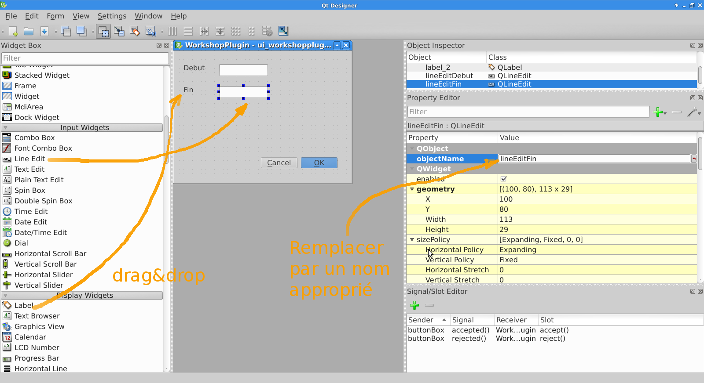

QGIS comme plateforme
=====================


Télécharger les données
-----------------------

Un shapefile des chantiers du Grand Lyon est disponible [ici](http://smartdata.grandlyon.com/smartdata/wp-content/plugins/wp-smartdata/proxy.php?format=Shape-zip&name=pvo_patrimoine_voirie.pvochantierperturbant&commune=&href=https%3A%2F%2Fdownload.data.grandlyon.com%2Fwfs%2Fgrandlyon%3FSERVICE%3DWFS%26REQUEST%3DGetFeature%26typename%3Dpvo_patrimoine_voirie.pvochantierperturbant%26outputformat%3DSHAPEZIP%26VERSION%3D2.0.0%26SRSNAME%3DEPSG%3A3946). Vous pouvez obtenir des détails en visitant http://smartdata.grandlyon.com/search/?Q=chantier.

Une fois le fichier récupéré, il faut le décompresser.


Charger les données dan QGIS
----------------------------

### Fond de plan

Ouvrir le menu 'Layers' et choisir 'Add WMS/WMTS Layer'. Dans la boite de dialogue cliquer sur 'new' et informer les champs suivants:
* Name: Grand Lyon
* URL: https://download.data.grandlyon.com/wms/grandlyon

Cliquer sur 'connect' et sellectioner la couche 'Plan guide du Grand Lyon'. Clicker sur 'Add' puis 'Close'.

### Couche vectorielle

Ouvrir le menu 'Layers' et choisir 'Add Vector Layer', cliquer sur 'Browse' et selectionner le fichier téléchargé avec l'extension '.shp' contenant les chantiers du Grand Lyon.

Dans le paneau 'Layers' (à gauche par defaut) selectionner la couche vectorielle, cliquer avec le bouton de droite pour obtenir le menu contextuel et sélectionner les propriétés de la couche.

Dans la fenêtre des propriétés, sélectioner l'onglet 'Style'. Sélectionner le rectangle montrant le style courant (paneau gauche).


Changez le style pour avoir des polygone blancs avec un contour rouge de 1.5 mm. Fermer la fenêtre en cliquant sur 'OK'.


Modifier le format des dates
----------------------------

Le fonctions de QGIS sont accessibles en python, ce qui permet de créer des extensions ou d'effectuer des traitements sur les données. Nous souhaitons changer le format des dates et transformer jj/mm/aaaa en aaaa/mm/jj afin de pouvoir utiliser l'extension TimeManager qui ne supporte pas le format.

Sélectioner la couche des chantiers, ouvrir le menu contextuel (click droit) et selectionner la table des attributs. Observer les champs 'debutchant' et 'finchantie'. Fermer la tables des attributs.


Dans le menu 'Plugins' sélectioner la console python. Dans la console pythin, entrer la commande:

```python
iface.activeLayer()
```
    
Qu'observez-vous? Sélectioner le fond de plan et relancer la commande (vous pouvez rapeller la dernière comande avec la touche flèche vers le haut).

Selectionner à nouveau la couche de chantiers et lancer la commande:

```python
for feature in iface.activeLayer().getFeatures():
    print feature['debutchant']
```
Nous utilisons la commande split() qui permet de découper une chaîne de charactère pour récupérer jour mois et années dans trois variables différentes, nous utilisons ensuite la fonction de formatage t=pour obtenir la date au format souhaité:

```python
for feature in iface.activeLayer().getFeatures():
    [jour, mois, annee] = feature['debutchant'].split('/')
    print "%s/%s/%s"%(annee, mois, jour)
```


```python
iface.activeLayer().startEditing() # passe la couche en mode édition

for feature in iface.activeLayer().getFeatures():
    [jour, mois, annee] = feature['debutchant'].split('/')
    fid = feature.id()
    field = feature.fieldNameIndex('debutchant')
    iface.activeLayer().changeAttributeValue(fid, field, "%s/%s/%s"%(annee, mois, jour))


iface.activeLayer().commitChanges() # sauve les modifications de la couche et sort du mode édition
```
Si aucune erreur ne survient, une liste de 'True' s'affiche, ce sont les valeurs de retour des fonction starEditing, changeAttributeValue et commitChanges. Si une erreur survient pendant l'execution, utiliser la fonction ```iface.activeLayer().rollBack()``` pour sortir du mode édition.

Ouvrir la table des attributs et vérifier que les modifications ont bien été faites.

Refaire la même modification pour le champ 'finchantie'.


L'extension TimeManager
-----------------------

Dans le menu 'Plugins' sélectionner 'Manage and install plugins'. Dans le champ 'Search' taper 'Time', sélectionner le plugin 'TimeManager' lisez la déscription du plugin en portant une attention particulière aux différents éléments présents (Titre, auteur etc.). Cliquer sur 'Install Plugin' puis sur 'Close'.

Dans le paneau 'Time Manager', cliquer sur 'Settings' et dans la fenètre 'Time manager settings' cliquer sur 'Add Layer' puis reseigner les champs:
* Start Time : debutchant
* End Time : finchantie
puis cliquer sur 'OK'.

Manipuler la molette de défilement du paneau 'Time Manager'. Que se passe-t-il ? 


Ouvrir la table attributaire. Qu'observez-vous ? Ouvrir les propriétés de la couche, dans l'onglet 'General' observez le champ 'Feature subset'. Fermez les propriétés, éteindre le 'Time Manager' (bouton ON/OFF) puis réouvrir les propriétés. Que pouvez-vous en déduire sur le fonctionnemement de 'Time Manager' ?


Adapter l'interface à nos besoins
---------------------------------

QGIS, présente une interface avec un grand nombre de fonctionalités qui est adaptés à des utilisateur SIG avancés. Cependant QGIS est aussi une plateforme qui permet de présenter au un autre type d'utilisateur, une interface adaptée à ses besoins.

Supposons que ne ne somme intéressé qu'à la visualisation (pas à l'édition) des différents chantiers. Nous souhaitons pouvoir cliquer sur un chantier sur la carte et optenir les information relatives à ce chantier.

Commençons par enregister le projet puisque nous allons bientôt devoir redémarrer QGIS.

Dans le menu 'Settings', choisir 'Customization'. Activer la personalisation (checkbox en haut à gauche) et désactiver les éléments qui ne vous semblent pas nécessaires à la tâche. 

*Attention* conserver le menu 'Settings' qui nous permettra de retrouver l'interface innitiale par la suite. 

Cliquer sur 'OK', quiter QGIS puis le démarrer de nouveau.


Développer un outil spécifique
------------------------------

Comme nous l'avons vu avec l'extension 'TimeManager', QGIS offre la possibilité de développer des extensions dédiées à des tâches spécifique.

Poursuivons notre exemple. Nous ne nous intéssons qu'au nom du chantier, sa date de début et sa date de fin. Nous souhaitons qu'un utlisateur puisse:
* naviguer sur la carte, 
* choisir un chantier avec la souris
* modifier la date de début et la date de fin du chantier

Pour celà nous allons développer une extension simple.

Commençons par répasser à l'interface par défaut en ouvrant la fenêtre 'Customization' et en désactivant la personalisation. Il faut redémarer QGIS.

L'extension 'Plugin Builder' va nous aider en nous fournissant une trame pour construire notre extension. Dans le menu 'Plugins' sélectionner 'Manage and install plugins'. Installer l'extension 'Plugin Builder'. Installer aussi l'extension 'Plugin Reloader'.

Fermer le gestionaire d'extensions. Dans le menu 'Plugins' choisir 'Plugin Builder'->'Plugin Builder'.


Lire la documentation (à gauche) et remplir les champs (à droite) en conséquence. Cliquer sur 'OK' et sellectionner le répertoire $HOME/.qgsi2/python/plugins pour sauver le plugin. Lire les explications dans le fenêtre de résultat qui s'affiche ensuite.

Ouvrir un gestionaire de fichier et explorer le répertoire $HOME/.qgsi2/python/plugins/LeNomDeMonPlugin.

Redémarrer QGIS.

Ouvrir le gestionaire d'extensions et essayer d'activer votre extension. Lisez le message d'erreur ! 

Ce plugin a besoin pour fonctionner d'un script python (extension .py) contenant l'interface graphique du plugin. Ce fichier est généré à partir du fichier de description de l'interface graphique (extension .ui) avec le programme pyuic4. Ouvrir une fenêtre de commande, aller dans le répertoire $HOME/.qgsi2/python/plugins/LeNomDeMonPlugin et executer la commande:

    pyuic4 interface_graphique.ui > ui_interface_graphique.py

Ce plugin a aussi besoin d'un script python qui contient l'icone (incon.png). Ce fichier est appelé fichier ressource et est généré à partir d'un fichier qui liste les éléments à utiliser comme ressource (extension .qrc) à l'aide du programme pyrcc4:

    pyrcc4 resources.qrc > resources_rc.py

Redémarrer QGIS. Ouvrir le gestionaire d'extensions et vérifier que votre extension est installée et activée. Observer la page de documentation de votre extension. Qu'y retrouve-t-in ?

Dans le menu 'Plugins' trouver l'entrée correspondant à votre plugin et cliquer sur 'run'.


## Que se passe-t-il ?

Ouvrir le fichier maclasse.py. C'est là que se trouve la logique de votre extension.

Lors du lancement de QGIS une instance de la classe définie dans maclasse.py est construite.Dit autrement, un objet python du type MaClasse est inititialisé en appelant la fonction `__init__` de la classe. On peut notament voir, à la fin de cette fonction, la création de l'interface graphique du plugin `self.dlg = ...` (cette interface n'est pas visible à ce moment.

La fonction `initGui` est appelée par QGIS une fois que l'interface graphique de QGIS est en place mais avant que les couches soient chargées. On peut voir que, dans notre cas, on crée une action qui, une fois déclanchée, va appeler la fonction `run` de MaClasse (`self.action.triggered.connect(self.run)`). Cette action est ensuite rendue accessible dans la barre d'outil et dans le menu 'Plugins'.

La fonction `run` montre la boîte de dialogue (`self.dlg.show`) et l'execute (`self.dlg.exec_()`).

La fonction `unload` est appelée lorsque l'on désactive l'extension:
* soit dans le gestonaire d'extensions, 
* soit lors de la fermeture de QGIS, 
* soit lors du rechargement de l'extension avec 'PluginReloader'.


## Réagir au clic sur la carte

Nous souhaitons avoir un outil qui affiche et permet de modifier les dates de début et de fin du chantier sélectionné par un clic sur la carte. Pour celà nous utilisons un objet de type `QgsMapToolEmitPoint` qui va générer un signal à chaque clic sur la carte.

Commençons par configurer 'Plugin Reloader' pour qu'il recharge notre extension. Dans le menu 'Plugins'->'Plugin Reloader'->'Choose plugin to reload' et sélectioner notre extension pui 'OK'. Désormais, chaque fois que l'on appuie sur la touche F5 du clavier, la fonction `unload` de MaClasse est appelée, les fichiers .py décrivant notre extension sont relus, puis les fonction `__init__` et `initGui` sont appellées.

Ouvrir le fichier maclasse.py et ajouter à la fonction `__init__` les lignes suivantes. *Attention* python est sensible à l'indentation, il faut donc aligner les lignes ajoutées avec la dernière ligne de la fonction `__init__`:

```python
        self.canvas = self.iface.mapCanvas()
        self.clickTool = QgsMapToolEmitPoint(self.canvas)
        self.clickTool.canvasClicked.connect(self.handleMouseDown)
```
Noter la connection du signal `canvasClicked` à la fonction `handleMouseDown` de MaClasse que nous allons devoir définir.

Il faut aussi ajouter, après la ligne `from qgis.core import *` la ligne:

```python
from qgis.gui import *
```

Car l'outil 'QgsMapToolEmitPoint' est défini dans les modules qgis relatifs à l'interface graphique (`gui`).


Pour que notre outil `clickTool` devienne l'outil courant lorsque l'on déclanche l'action de notre extension, remplacer la fonction `run` par:

```python
    def run(self):
        self.canvas.setMapTool(self.clickTool)
```

Ajouter la fonction `handleMouseDown` qui réagit à l'émission du signal par notre outil de clic:

```python
    def handleMouseDown(self, point, button):
        # show the dialog
        self.dlg.show()
        # Run the dialog event loop
        result = self.dlg.exec_()
        # See if OK was pressed
        if result == 1:
            # do something useful (delete the line containing pass and
            # substitute with your code)
            pass

        self.iface.actionPan().trigger()
```

Noter la dernière ligne qui réactive l'outil pan/zoom une fois la boîte de dialogue fermée.

Recharger l'extension (touche F5) et tester.


## Modifier l'interface graphique

Notre boîte de dialogue ne contient pour l'instant que deux boutons, nous souhaitons ajouter des champs éditables contenant la date de début et la date de fin du chantier. Pour celà nous alons modifier notre interface graphique avec Qt-Designer.

Dans une fenêtre de commande, aller dans le répertoire $HOME/.qgsi2/python/plugins et lancer la commande:

    designer ui_workshopplugin.ui

Ajouter les champs éditables et les étiquettes. Modifier le nom des champs éditables pour pouvoir s'y référer plus facilement dans nos fonctions. Sauver et quiter.



Il faut ensuite régénerer le fichier ui_interface_graphique.py.

    pyuic4 interface_graphique.ui > ui_interface_graphique.py

Recharger l'extension dans QGIS (F5), tester.


## Terminer l'extension

Il nous faut maintenant modifier notre fonction `handleMouseDown` pour y afficher le début et la fin du chantier et les modifier dans la couche si l'utilisateur appuie sur 'OK'. La fonction `handleMouseDown` devrait alors ressembler à cela:

```python
    def handleMouseDown(self, point, button):

        # we assume one vector layer and optionnally a second layer that is not a vector layer
        layers = [layer for layerId, layer in QgsMapLayerRegistry.instance().mapLayers().iteritems()]
        layer = layers[0] if isinstance(layers[0], QgsVectorLayer) else layers[1]
       
        # we create a rectangle of 2 pixels around the point 
        # and select the first feature in this rectangle
        nbPixels = 2
        pointGeometry = QgsGeometry.fromPoint(point)
        pointBuffer = pointGeometry.buffer( (self.canvas.mapUnitsPerPixel() * nbPixels),0)
        rectangle = pointBuffer.boundingBox()
        features = layer.getFeatures( QgsFeatureRequest(rectangle))

        for feature in features:
            self.dlg.ui.lineEditDebut.setText(feature['debutchant'])
            self.dlg.ui.lineEditFin.setText(feature['finchantie'])
              
            # show the dialog
            self.dlg.show()
            # Run the dialog event loop
            result = self.dlg.exec_()
            # See if OK was pressed
            if result == 1:
                fid = feature.id()
                field = feature.fieldNameIndex('debutchant')
                layer.changeAttributeValue(fid, field, self.dlg.ui.lineEditDebut.text())
                field = feature.fieldNameIndex('finchantie')
                layer.changeAttributeValue(fid, field, self.dlg.ui.lineEditFin.text())

        self.iface.actionPan().trigger()
```

Recharger l'extension et tester.


